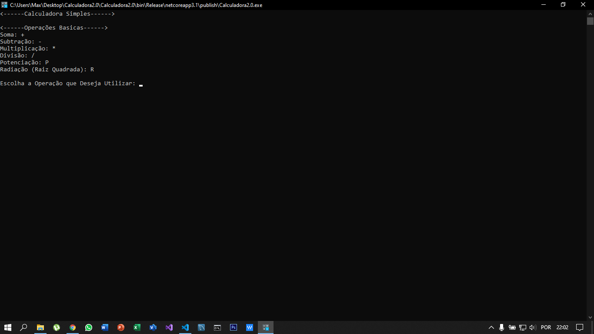

<h1>Projeto: Calculadora</h1>

<h2>Objetivo</h2> 
<h3>Criar um software que permitam que o usuário efetue operações matemáticas (o usuário digita os números desejados, e o programa exibe o resultado):

- Soma
- Subtração
- Multiplicação
- Divisão
- Exponenciação
- Radiciação

</h3>

## _Screenshot_

## _Download_

Baixe o arquivo abaixo. Descompacte na pasta desejada 
Download do arquivo.zip [Clique Aqui](dist/calculadora.zip)

## Agradecimentos

- [Etec Adolpho Berezin](http://eteab.com.br/cms/)
- [Prof: Ermogenes Palacio](https://github.com/ermogenes)
- [Prof: Diego Neri de Souza Felix](https://github.com/diegoneri)
- [DevC#](https://github.com/ermogenes/aulas-programacao-csharp)

Todos os direitos reservados! 
[Max Willer Leonel](https://github.com/MWLeonel) &copy;
Mongaguá - 2020

